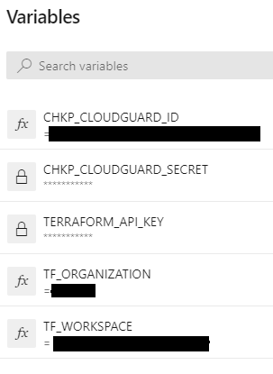
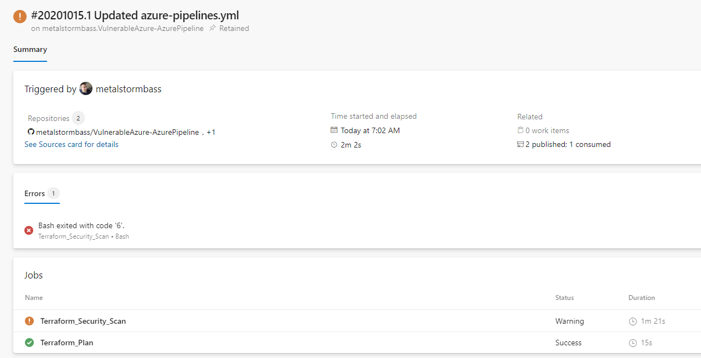

# VulnerableAzure-AzurePipeline
Written by Michael Braun

    

  

This document outlines how to integrate Check Point ShiftLeft into an Azure DevOps CI/CD pipeline. <b>This is for demonstration purposes only.</b> In this Github repositiory, I have created a vulnerable by design Azure deployment. I will show how you can use Check Point ShiftLeft to identify security issues prior to them reaching the cloud. [Here](https://github.com/metalstormbass/VulnerableAzure) is the full documentation of the VulnerableAzure project is used in this demo. This particular demo also uses my [Vulnerable Web App](https://github.com/metalstormbass/VulnerableWebApp)  and  [OWASP Juice Shop](https://github.com/bkimminich/juice-shop) as components.    

This is the high level build pipeline workflow:  

    1. Prepares environment  
    2. Checkout Code from the main repository and the VulenableWebApp repository  
    3. Performs Shiftleft IAC scan  
    4. Performs Shiftleft SourceGuard Scan  
    5. Performs Shiftleft Container Scan  
    6. Builds VulnerableWebApp.zip build artifact for Deployment  
    7. Installs Terraform & Runs Terraform init, plan.   
    8. Builds VulnerableAzure.zip build artifact for deployment.   
  
 Due to there being security issues, this is why we see the Azure pipeline status as being partially sucessful.  
 
  

 
 This is the high level workflow of the Deploy to Azure release pipeline:  

    1. Automatically initiate pipeline when a new build artifact is created  
    2. Prompt for manually approval of release  
    3. Install Terrafrom, do a init, plan and apply. This deploys the architecture  
    4. Provision the app service with the VulnerableWebApp.zip build artifact  

 This is the high level workflow of the Destroy release pipeline:  

    1. Install Terraform and run destroy  

## Prerequisites

[Github Account](https://github.com)  
[Azure Account](https://portal.azure.com)  
[Terraform Cloud Account](https://terraform.io)  
[Check Point Cloud Portal](https://portal.checkpoint.com)
[Check Point CSPM Account](https://secure.dome9.com/v2/login)

## Setup

Fork the [VulnerableAzure-AzurePipeline](https://github.com/metalstormbass/VulnerableAzure-AzurePipline) repository into your personal Github account. 
 

### Microsoft Azure
 Create an App Registration in Azure. As this will be used multiple times, please note the following:

- Application (client) ID  
- Directory (tenant) ID  
- Secret  
- Subscription ID  

Ensure that you give this app registration "Contributor" permission. This is required for Terraform to build the environment.

### Terraform
Terraform Cloud is being used to host the variables and the state file. The actual run occurs in Github Actions.

Create a new workspace in your Orginization and select CLI-driven run. The configure your variables.

Start with the Environment Variables. Input the Azure App Registration information you noted earlier. Use the following keys.

Then fill in the variables required to run the Terraform playbook. Reuse the Azure App Registration client id and secret for the client_id and the client_secret variables. <b>Note: You cannot have spaces or special characters. This is an Azure limitation</b>

Under the user settings, select Tokens and create an API token. Note the value for later. 

Finally, in the workspace you created, click on Settings > General Settings and note the Workspace ID. We need to this to setup the API call to Terraform.io

## Azure Devops Build Pipeline Configuration

Create a new project in Azure Devops.  

  

Connect it to your github repository, review the pipeline YAML and <b> save </b> the pipeline.  

  

We need to configure the variables in order for the pipeline to run. Once the setup is complete, select piplines > edit. This will allow you to review the YAML and configure the variables. Ensure you have the following variables.  

  

This will allow you to run the pipeline build. This is what a successful build looks like. Note that the error is due to the code failing the security checks from Cloudguard ShiftLeft. For demonstration purposes, I have set the pipeline to continue on error.  

  

Please review the [azure-pipelines.yml](azure-pipelines.yml) file to see the entire workflow.

## Azure Devops Build Pipeline Configuration

