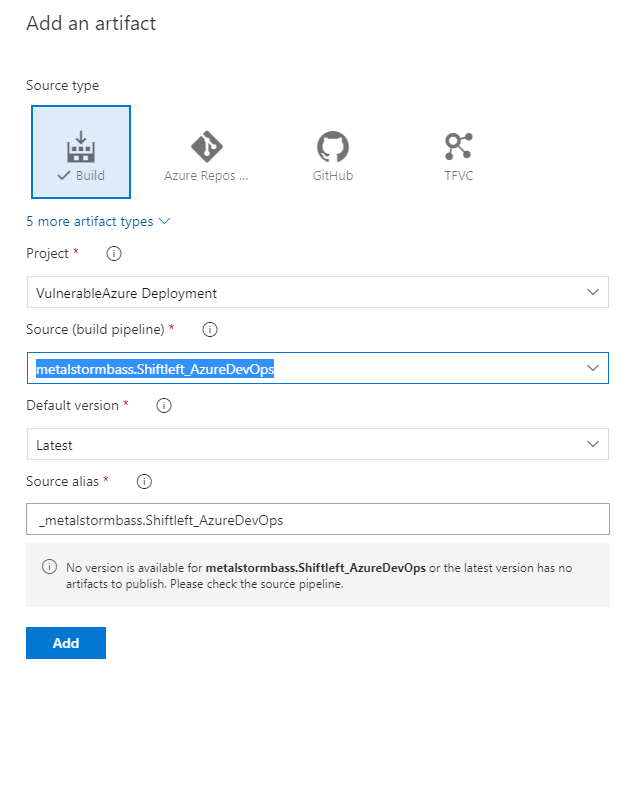

# VulnerableAzure-AzurePipeline
Written by Michael Braun

<p align="left">
    
</p>  

[](https://dev.azure.com/mibraun/VulnerableAzure%20Deployment/_build/latest?definitionId=1&repoName=metalstormbass%2FVulnerableAzure-AzurePipeline&branchName=master)

This document outlines how to integrate Check Point ShiftLeft into an Azure DevOps CI/CD pipeline. <b>This is for demonstration purposes only.</b> In this Github repositiory, I have created a vulnerable by design Azure deployment. I will show how you can use Check Point ShiftLeft to identify security issues prior to them reaching the cloud. [Here](https://github.com/metalstormbass/VulnerableAzure) is the full documentation of the VulnerableAzure project is used in this demo. This particular demo also uses my [Vulnerable Web App](https://github.com/metalstormbass/VulnerableWebApp)  and  [OWASP Juice Shop](https://github.com/bkimminich/juice-shop) as components. <br> <br>

### Build Workflow

This is the high level build pipeline workflow: <br>

    1. Prepares environment <br>
    2. Checkout Code from the main repository and the VulenableWebApp repository <br>
    3. Performs Shiftleft IAC scan <br>
    4. Performs Shiftleft SourceGuard Scan <br>
    5. Performs Shiftleft Container Scan <br>
    6. Builds VulnerableWebApp.zip build artifact for Deployment <br>
    7. Installs Terraform & Runs Terraform init, plan.  <br>
    8. Builds VulnerableAzure.zip build artifact for deployment.  <br>
 <br>
 
 <b> NOTE: </b> Due to there being security issues, this is why we see the Azure pipeline status as being partially sucessful. Also, when you fork this repository, you will have to update the badge with your build. That process will be outlined later in this document <br>
 
[](https://dev.azure.com/mibraun/VulnerableAzure%20Deployment/_build/latest?definitionId=1&repoName=metalstormbass%2FVulnerableAzure-AzurePipeline&branchName=master)  
<br>

### Release Workflow

 This is the high level workflow of the Deploy to Azure release pipeline: <br>

    1. Automatically initiate pipeline when a new build artifact is created <br>
    2. Prompt for manually approval of release <br>
    3. Install Terrafrom, do a init, plan and apply. This deploys the architecture <br>
    4. Provision the app service with the VulnerableWebApp.zip build artifact <br>

 This is the high level workflow of the Destroy release pipeline: <br>

    1. Install Terraform and run destroy <br>


## Prerequisites

[Github Account](https://github.com) <br>
[Azure Account](https://portal.azure.com) <br>
[Terraform Cloud Account](https://terraform.io) <br>
[Check Point CSPM Account](https://secure.dome9.com/v2/login) - <b> Generate CSPM API Key </b> <br>


## Setup

Fork the [VulnerableAzure-AzurePipeline](https://github.com/metalstormbass/VulnerableAzure-AzurePipline) repository.
<br><br>

Fork the [VulnerableWebApp](https://github.com/metalstormbass/VulnerableWebApp) repository.
<br> 


### Microsoft Azure
 Create an App Registration in Azure. As this will be used multiple times, please note the following:

- Application (client) ID <br>
- Directory (tenant) ID <br>
- Secret <br>
- Subscription ID <br>

Ensure that you give this app registration "Contributor" permission. This is required for Terraform to build the environment.

### Terraform
Terraform Cloud is being used to host the variables and the state file. The actual run occurs in Github Actions.

Create a new workspace in your Orginization and select CLI-driven run. The configure your variables.


Start with the Environment Variables. Input the Azure App Registration information you noted earlier. Use the following keys.


Then fill in the variables required to run the Terraform playbook. Reuse the Azure App Registration client id and secret for the client_id and the client_secret variables. <b>Note: You cannot have spaces or special characters. This is an Azure limitation</b>


Under the user settings, select Tokens and create an API token. Note the value for later. 


Finally, in the workspace you created, click on Settings > General Settings and note the Workspace ID. We need to this to setup the API call to Terraform.io

## Azure Devops Build Pipeline Configuration

Create a new project in Azure Devops. <br>

 <br>

Navigate to the <b> Pipeline </b> section.

Connect it to your github repository, review the pipeline YAML and <b> save </b> the pipeline. <br>

 <br>

### Plugins

This pipeline makes use of the Terraform plugin for Azure DevOps. Please make sure you install it and apply it to the organization in which you're building this pipeline. The plugin can be found [HERE](https://marketplace.visualstudio.com/items?itemName=ms-devlabs.custom-terraform-tasks)

### Service Connection
In order to copy the VulnerableWebApp code, you must create a service connection to Github. Do this by selecting "Project Settings" and "Service Connection". Then modify the following lines 

### Variables

We need to configure the variables in order for the pipeline to run. Once the setup is complete, select piplines > edit. This will allow you to review the YAML and configure the variables. Ensure you have the following variables. <br>

 <br>

``` bash

CHKP_CLOUDGUARD_ID #CSPM API KEY
CHKP_CLOUDGUARD_SECRET #CSPM API SECRET
TERRAFORM_API_KEY #TERRAFORM API KEY
TF_ORGANIZATION #TERRAFORM ORGANIZATION AS DEFINED IN TERRAFORM.IO
TF_WORKSPACE #TERRAFORM WORKSPACE AS DEFINED IN TERRAFORM.IO

```
This will allow you to run the pipeline build. This is what a successful build looks like. Note that the error is due to the code failing the security checks from Cloudguard ShiftLeft. For demonstration purposes, I have set the pipeline to continue on error. <br>


### Badge

Open up the pipeline and click on the three dots in the top left corner. Select "Badge" and then copy the sample markdown. Replace the markdown in the README with your badge.


<br>

Please review the [azure-pipelines.yml](azure-pipelines.yml) file to see the entire workflow.

When the pipeline completes, it will generate two artifacts: <br>
<b>VulnerableAzure.zip</b> - This is the Terraform template that has been scanned and format checked. <br>
<b>VulnerableWebApp.zip</b> - This is the code of the Vulnerable Web Application that has been scanned. <br>

## Shift Left - DevSecOps

There are three components to the ShiftLeft<br><br>

The first is the infrastructure as code scan. This will scan the Terraform code and compare it againts a rule that has been defined in Check Point CPSM. 

```
Shiftleft_AzureDevOps/shiftleft iac-assessment -r 201981 --path Shiftleft_AzureDevOps/
```

Note: <b>In this case, the rule number 201981 is specific to my tenant. You will need to change this for your pipeline. </b>

The second component is scanning the source code of the web application. This looks for vulnerabilities in the code as well as hard coded secrets, etc.

```
Shiftleft_AzureDevOps/shiftleft code-scan -s VulnerableWebApp/
```

The final component is the container scan. This checks the security of the container image prior to it being deployed.

```
Shiftleft_AzureDevOps/shiftleft image-scan --timeout 1800 --image ./juice_shop.tar
```

## Azure Devops Release Pipeline Configuration - Deployment

Once the build pipeline is complete, you must then configure the release pipeline. This is done through the web interface and not with YAML. Create a new pipeline and start by configuring the variables: <br>


### Artifact

First, you must configure the release pipeline to accept the artifacts from the build pipeline:




### Deploy infrastructure with Terraform

From there, I have configured a manual approval in the pre-deloyment conditions. This is so I can control when I deploy to Azure.


The first stage is deploying the infrastructure using Terraform. This job has two tasks, Install Terraform and then run Terraform Apply. First, lets examine the Terraform installer:


The next step is to actually deploy the artifact to Azure with Terraform:


Use this code:

```
unzip VulnerableAzure/VulnerableAzure.zip
terraform init
terraform plan
terraform apply -auto-approve
```

<b>Note: You must configure the working directory for this to function correctly</b>

### Deploy code to App Services

The second stage also contains two tasks. The first task is to determine the name of the Azure AppService which was created by Terraform. This is done by making an API call to Terraform.io


Here is the code:

```
out=`curl --silent --header "Authorization: Bearer $TF_API_TOKEN" --header "Content-Type: application/vnd.api+json" https://app.terraform.io/api/v2/workspaces/$TF_WORKSPACE_ID/vars | jq -c --arg key "victim-company" '.data[].attributes | select 
(.key=="victim_company") | .value' | tr -d \"`

echo "##vso[task.setvariable variable=APP_NAME]${out}-app-service"
echo "##vso[task.setvariable variable=RG]${out}-rg"
```

The final step is to use the AZ command line to deploy the artifact produced from the release pipeline:


<b>Note: You must configure the working directory for this to function correctly</b>

Here is the code:

```
az webapp deployment source config-zip --name $APP_NAME --resource-group $RG --src VulnerableWebApp/VulnerableWebApp.zip 

az webapp config set -g $RG -n $APP_NAME --startup-file /home/site/wwwroot/VulnerableWebApp/startup.sh
```
This completes the deployment configuration.

## Azure Devops Release Pipeline Configuration - Destruction/Cleanup

Configuring the destroy pipeline is very similar to the deploy pipeline.

### Artifact

First, you must configure the release pipeline to accept the artifacts from the build pipeline:


### Destroy

In this case I have disabled the continuous deployment feature as I want to control when I destroy the environment. As a pre-deployment condition, I have configured it to be a manual only pipeline:


This pipeline has a single stage with two tasks. The first is again installing Terraform:


Finally, I am running Terraform destroy:


```
unzip VulnerableAzure/VulnerableAzure.zip
terraform init
terraform destroy -auto-approve
```


